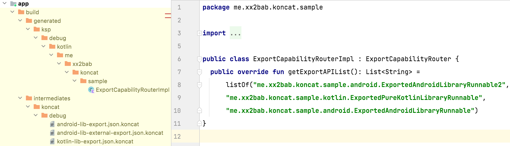

# Koncat


[](https://search.maven.org/artifact/me.2bab/koncat-processor-api) 
[](https://github.com/2bab/Koncat/actions) 
[](https://www.apache.org/licenses/LICENSE-2.0)

Concat intermediates of KSP of multiple modules for Android development.


## Usage

**0x01. Add the plugin to classpath:**

``` kotlin
// Option 1.
// Add `mavenCentral` to `pluginManagement{}` on settings.gradle.kts,
// and koncat plugins ids.
pluginManagement {
	val koncatVer = "1.0.0"
	repositories {
        ...
        mavenCentral()
    }
    plugins {
    	...
    	id ("me.2bab.koncat.android.app") version koncatVer apply false
        id ("me.2bab.koncat.android.lib") version koncatVer apply false
        id ("me.2bab.koncat.jvm") version koncatVer apply false
    }
}


// Option 2.
// Using classic `buildscript{}` block in root build.gradle.kts.
buildscript {
    repositories {
        ...
        mavenCentral()
    }
    dependencies {
    	...
        classpath("me.2bab:koncat-gradle-plugin:1.0.0")
    }
}
```

**0x02. Add Koncat Gradle Plugins:**

Where you applied KSP plugin should append the `me.2bab.koncat.*` plugin as well.

``` kotlin
// For Android Application module
plugins {
    id("com.android.application")
    kotlin("android")
    id("com.google.devtools.ksp")
    id("me.2bab.koncat.android.app")  <--
}

// For Android Library module
plugins {
    id("com.android.library")
    kotlin("android")
    id("com.google.devtools.ksp")
    id("me.2bab.koncat.android.lib")  <--
}

// For JVM library module
plugins {
    kotlin("jvm") // or `java`, `groovy` plugins, etc.
    id("com.google.devtools.ksp")
    id("me.2bab.koncat.jvm")  <--
}
```

**0x03. Add Koncat processor-api library**

``` kotlin
package me.xx2bab.koncat.sample.kotlin

...
import me.xx2bab.koncat.api.Koncat
import me.xx2bab.koncat.api.adapter.KSPAdapter
import me.xx2bab.koncat.contract.KONCAT_FILE_EXTENSION

class ExportAnnotationProcessorProvider : SymbolProcessorProvider {
    override fun create(
        env: SymbolProcessorEnvironment
    ): SymbolProcessor {
        return ExportAnnotationProcessor(
            env.codeGenerator,
            env.logger,
            Koncat(KSPAdapter(env))    ①
        )
    }
}

class ExportAnnotationProcessor(
    val codeGenerator: CodeGenerator,
    val logger: KSPLogger,
    val koncat: Koncat
) : SymbolProcessor {

    private var exportMetadata = ExportMetadata()

    override fun process(resolver: Resolver): List<KSAnnotated> {
        val symbols =
            resolver.getSymbolsWithAnnotation("me.xx2bab.koncat.sample.annotation.ExportAPI")
        val ret = symbols.filter { !it.validate() }.toList()
        symbols
            .filter { it is KSClassDeclaration && it.validate() }
            .forEach { it.accept(BuilderVisitor(), exportMetadata) }
        return ret
    }

    @OptIn(KotlinPoetKspPreview::class)
    override fun finish() {
        super.finish()
        if (koncat.isMainProject()) {    ②
            // Merge all ExportMetadata
            val subProjectMetadataList = koncat.getIntermediatesDir().walk()    ④
                .filter { it.extension == KONCAT_FILE_EXTENSION }
                .map { subProjectMetadataFile ->
                    logger.info(LOG_TAG + "Start processing ${subProjectMetadataFile.absolutePath}")
                    Json.decodeFromStream<ExportMetadata>(
                        subProjectMetadataFile.inputStream()
                    )
                }
            val all = mutableListOf<ExportMetadata>()
            all.add(exportMetadata)
            all.addAll(subProjectMetadataList)    ⑤
            // Generate the final file
            val fileSpec = RouterClassBuilder(all).build()
            fileSpec.writeTo(codeGenerator, Dependencies(aggregating = false))
        } else {  
            // Generate intermediate JSON file
            val os = codeGenerator.createNewFile(    
                Dependencies(aggregating = false),
                "",
                koncat.projectName + "-export",
                "json.$KONCAT_FILE_EXTENSION"    ③
            )
            os.appendText(Json.encodeToString(exportMetadata))
            os.close()
        }
    }

    inner class BuilderVisitor() : KSVisitorWithExportMetadata() {
        override fun visitClassDeclaration(
            classDeclaration: KSClassDeclaration,
            data: ExportMetadata
        ) {
            data.exportAPI.add(classDeclaration.qualifiedName!!.asString())
        }
    }

    inner class RouterClassBuilder(
        private val dataList: List<ExportMetadata>
    ) {
        fun build(): FileSpec {
            ...
            return FileSpec.builder("me.xx2bab.koncat.sample", "ExportCapabilityRouterImpl")
                .addType(
                    TypeSpec.classBuilder("ExportCapabilityRouterImpl")
                        .addSuperinterface(routerInterface)
                        .addFunction(getExportAPIListFunSpec)
                        .build()
                )
                .build()
        }
    }

}
```

- ① Initialize `Koncat` by passing the `KSPAdapter` with current `SymbolProcessorEnvironment`.
- ② `Koncat#isMainProject()` tells if the current processor is running for main project.
- ③ When it is NO, it denotes we need to generate an intermediate file instead of a `.java` or `.kt` here, for instance a `.json` file that collect essential information for subsequent usage. Note that `KONCAT_FILE_EXTENSION` is required to append to file extension string, as a flag to indicate it's a Koncat targeted meta file.
- ④ When it is YES, it denotes it's time to aggregate all intermediates from sub projects by `Koncat#getIntermediatesDir()`.
- ⑤ Merge [intermediates from sub projects] and [intermediate from main project], we are ready to generate the final class based on them.


**0x04. Build your App and Enjoy!**




## Compatible

ScratchPaper is only supported & tested on LATEST 2 Minor versions of Android Gradle Plugin and KSP. 

Koncat (Per minor version) |Suggested Env
-----------|-----------------
1.0.0 | AGP 7.1/7.2 x KSP 1.6.10-1.0.4


## Why Koncat?

A few precondition for Koncat used scenarios:

1. The project has multiple Gradle modules.
2. It requies to gather all meta info of annotated elements, for example a permission anntation on an Activity.
3. And later generate a aggregated class for quering/reporting/etc.

If DI frameworks suits well with current project, for example using the `Multibinding` feature from Koin/Dagger/Hilt, then Koncat is not necessary for it.

Koncat runs in compiler time, enhance the annotation processor capability:

- It can save hundreds of millseconds for launch-time of the app comparing to the runtime aggregation.
- It would be much earsier to generate source code file during AnnotationProcessor stage comparing to generate byte code during transforming stage.


## Git Commit Check

Check this [link](https://medium.com/walmartlabs/check-out-these-5-git-tips-before-your-next-commit-c1c7a5ae34d1) to make sure everyone will make a **meaningful** commit message.

So far we haven't added any hook tool, but follow the regex below:

```
(chore|feature|docs|fix|refactor|style|test|hack|release)(:)( )(.{0,80})
```


## License

>
> Copyright 2022 2BAB
>
>Licensed under the Apache License, Version 2.0 (the "License");
you may not use this file except in compliance with the License.
You may obtain a copy of the License at
>
>   http://www.apache.org/licenses/LICENSE-2.0
>
> Unless required by applicable law or agreed to in writing, software
distributed under the License is distributed on an "AS IS" BASIS,
WITHOUT WARRANTIES OR CONDITIONS OF ANY KIND, either express or implied.
See the License for the specific language governing permissions and
limitations under the License.

